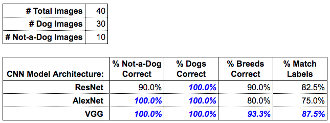

# Image Classification for a City Dog Show

In this project we will use a created image classifier to identify dog breeds.

## Description

Your city is hosting a citywide dog show and you have volunteered to help the organizing committee with contestant registration. Every participant that registers must submit an image of their dog along with biographical information about their dog. The registration system tags the images based upon the biographical information.

Some people are planning on registering pets that aren’t actual dogs.

## Important Notes
For this image classification task we will be using an image classification application using a deep learning model called a convolutional neural network (often abbreviated as CNN). CNNs work particularly well for detecting features in images like colors, textures, and edges; then using these features to identify objects in the images. You'll use a CNN that has already learned the features from a giant dataset of 1.2 million images called ImageNet. There are different types of CNNs that have different structures (architectures) that work better or worse depending on the criteria. With this project we will explore the three different architectures...
- AlexNet
- VGG
- ResNet

We will determine which is best for our application.

Remember that certain breeds of dog look very similar. The more images of two similar looking dog breeds that the algorithm has learned from, the more likely the algorithm will be able to distinguish between those two breeds. We have found the following breeds to look very similar: Great Pyrenees and Kuvasz, German Shepherd and Malinois, Beagle and Walker Hound, amongst others.

One way to do this is to call the program from the terminal window for one of the models, wait until it completes running, record it's results, and then repeat for the other two models.

```python check_images.py --dir pet_images/ --arch <architecture>  --dogfile dognames.txt```

An easier way to handle this task is with batch processing using a shell script. For this exercise, you will find the bash program `run_models_batch.sh`. Open that file and you will notice comments use # just like python and the rest look the same as the commands you type into the terminal window to run your program (see code below).

```#  Code from run_models_batch.sh 
python check_images.py --dir pet_images/ --arch resnet  --dogfile dognames.txt
     > resnet_pet-images.txt
python check_images.py --dir pet_images/ --arch alexnet  --dogfile dognames.txt  
     > alexnet_pet-images.txt
python check_images.py --dir pet_images/ --arch vgg  --dogfile dognames.txt 
     > vgg_pet-images.txt
```

You will also notice that each file ends with `> filename.txt`. The `>` is a pipe and it pipes the output from the console into a file. The file contains the filename of the model being used. This way after each run, the results are automatically stored.

To run file run_models_batch.sh...

```sh run_models_batch.sh```
___
## Results Table


Given our results, the "best" model architecture is VGG. It out performed both of the other architectures when considering both objectives 1 and 2. You will notice that ResNet did classify dog breeds better than AlexNet, but only VGG and AlexNet were able to classify "dogs" and "not-a-dog" at 100% accuracy. The model VGG was the one that was able to classify "dogs" and "not-a-dog" with 100% accuracy and had the best performance regarding breed classification with 93.3% accuracy.